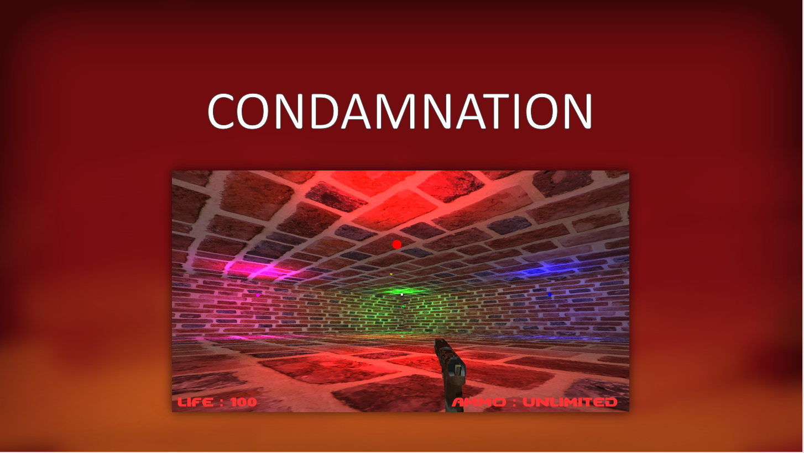
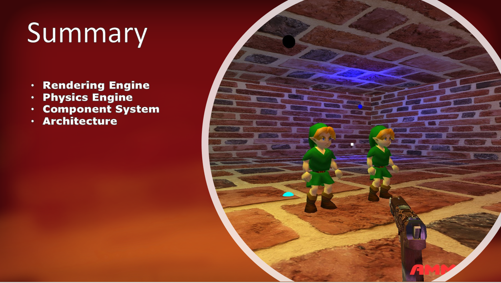
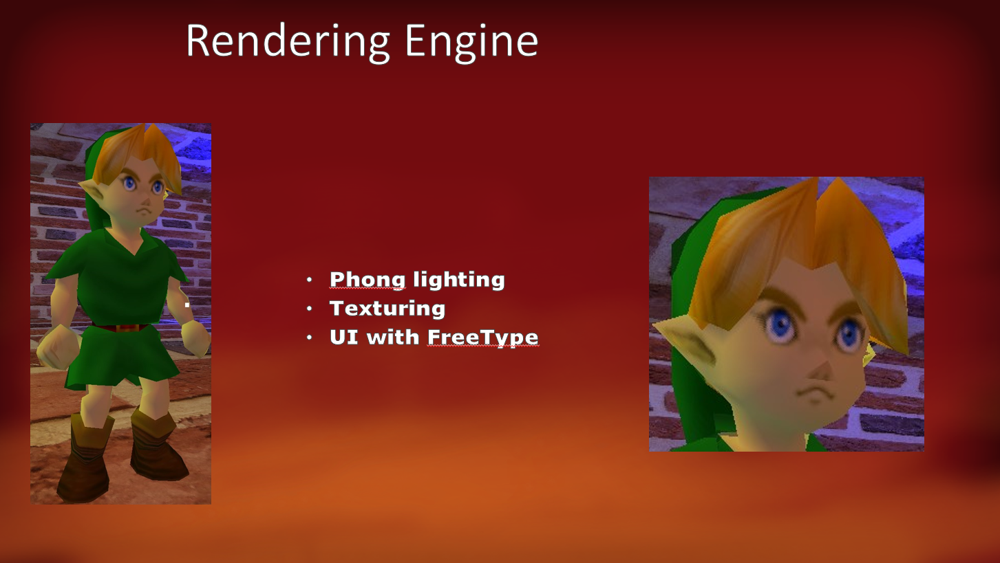
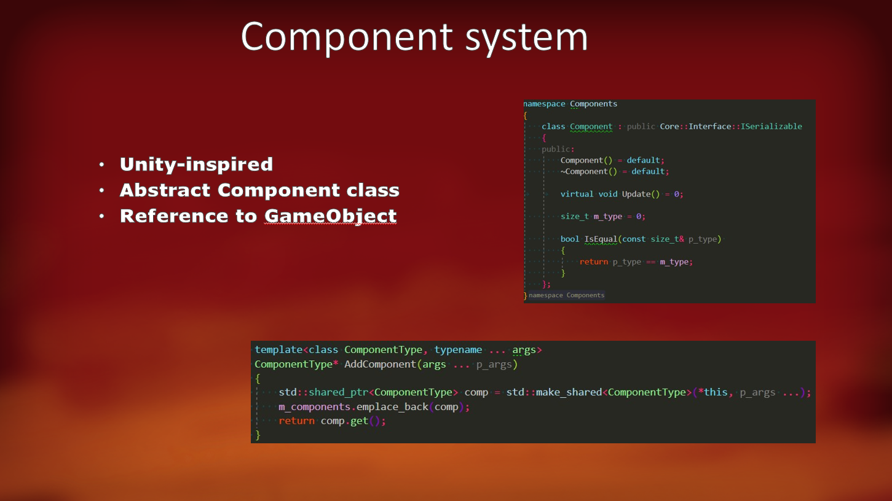
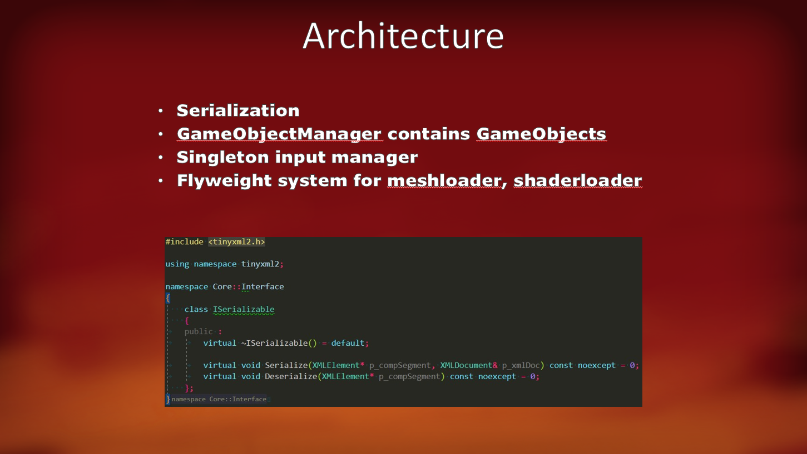
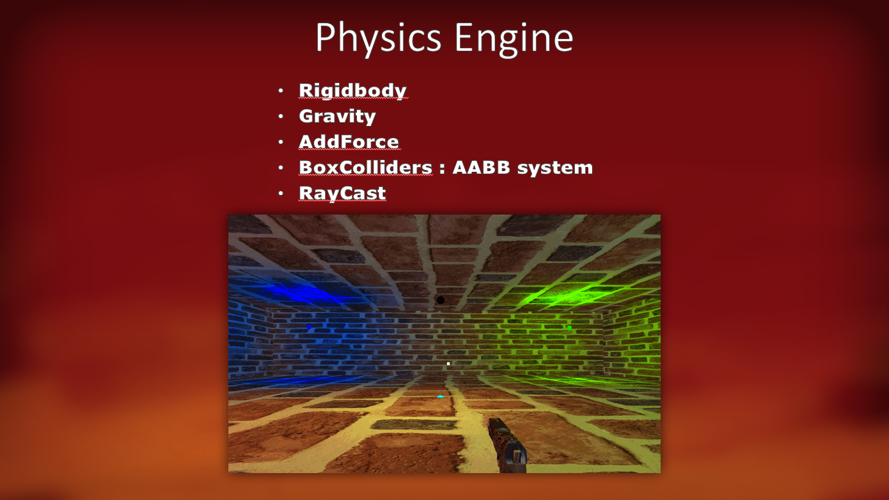

# Condamnation
This is my "End of the year" project as a first year student in Game Engine Programming

We had to maka basic and simple Game Engine supporting a homemade physics Engine, a component system, and a Rendering model like BlinnPhong or Phong

